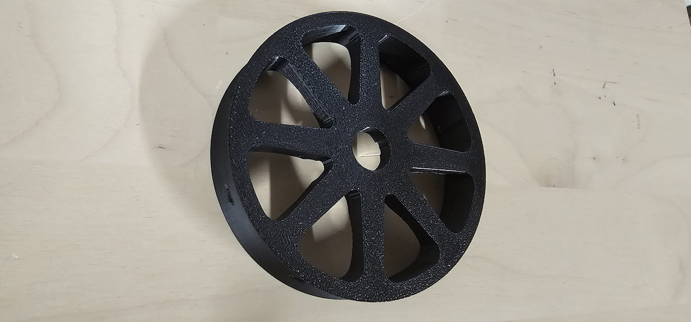
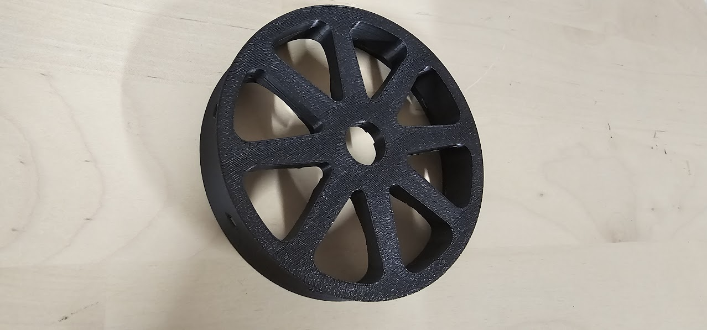

# RELAX: Release and Destress Cycle for 3D Printing

RELAX is a Klipper macro for automating the process of releasing 3D printed parts from the bed and performing destress heating to minimize stress marks and thermal-induced warping. The macro is highly configurable, allowing you to adjust temperatures, times, and even cooling fan settings.

---

## Features

- **Release Parts Automatically**: Heat the bed to a configurable release temperature, allowing parts to detach smoothly.
- **Destress Heating**: Relieve internal stresses in your printed parts with controlled heating and holding cycles.
- **Optional Bed Fan Support**: Use bed fans during the process for enhanced cooling.
- **Customizable Parameters**: Fine-tune temperatures and durations to match your material and project requirements.
- **Auto Updates**: Easily update the macro through Moonraker's update manager.

---

## Before and After

### Before Destressing


### After Destressing


---

## Installation

1. Copy the `RELAX` macro into your Klipper configuration file.
2. Save the macro under a descriptive file name, such as `relax.cfg`.
3. Include the macro in your main printer configuration:
   ```ini
   [include relax.cfg]
   ```
4. **Integrate into `PRINT_END`:** Add the following line to your `PRINT_END` macro to automatically invoke the RELAX cycle at the end of a print:
   ```ini
   RELAX
   ```
5. **Enable Automatic Updates**:
   Add the following entry to your `moonraker.conf` file to enable auto-updates for RELAX:
   ```ini
   [update_manager relax]
   type: file
   path: ~/printer_data/config/relax.cfg
   url: https://raw.githubusercontent.com/interias/relax/main/relax.cfg
   ```

---

## Usage

To execute the RELAX macro manually, you can call it with default settings:
```gcode
RELAX
```

Or customize parameters for your specific use case:
```gcode
RELAX release_temp=60 release_time=150 destress_temp=110 destress_time=400 use_bedfans=true
```

### Parameters
- `release_temp`: Target temperature to release parts from the bed (default: 50°C).
- `release_time`: Time in seconds to hold the release temperature (default: 120s).
- `destress_temp`: Target temperature for stress relief (default: 100°C).
- `destress_time`: Time in seconds to hold the destress temperature (default: 300s).
- `use_bedfans`: Enable or disable bed fans (`true` or `false`, default: `false`).

---

## Example

An example use case for ABS:
```gcode
RELAX release_temp=60 release_time=150 destress_temp=110 destress_time=400 use_bedfans=true
```

---

## Feedback and Contributions

Author: **Stefan Börzel**  
Discord: `sbrzl_3.14`

Feedback, suggestions, and contributions are welcome!  
GitHub Repository: [RELAX](https://github.com/interias/relax)

---

## License

This project is open-source under the MIT License. Feel free to use, modify, and share the code with attribution.
